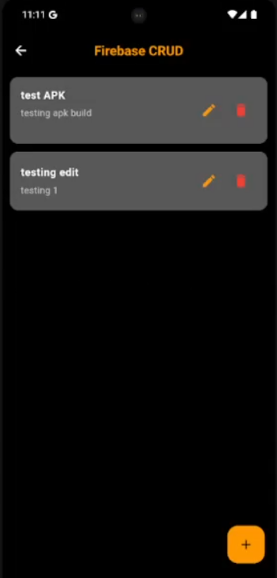
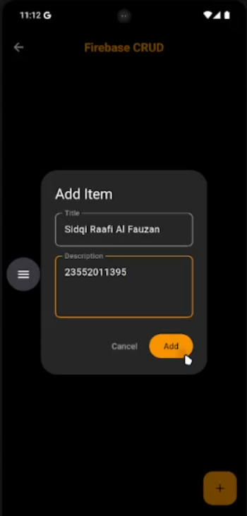
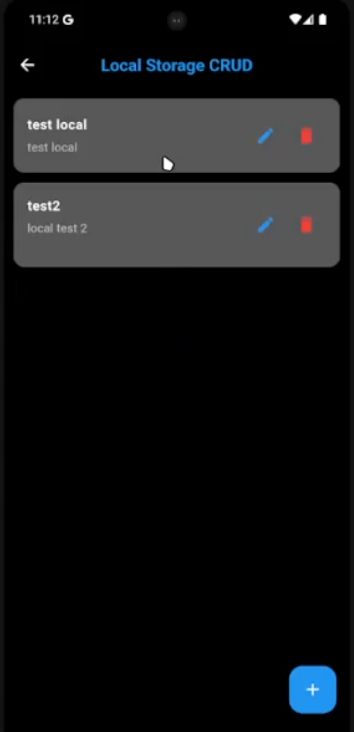
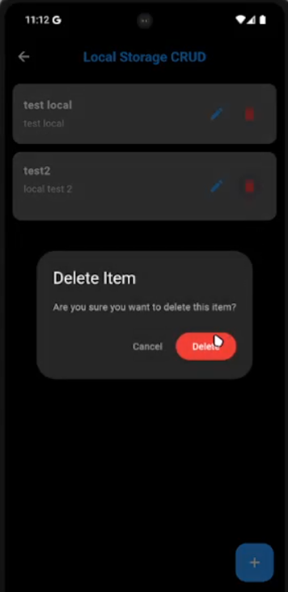

# CRUD Testing App
[](https://flutter.dev/)
[](https://dart.dev/)
[](https://firebase.google.com/)
[](https://github.com/SidqiRaafi/crud-testing)
[](LICENSE)
[](https://github.com/SidqiRaafi/crud-testing/graphs/commit-activity)

A modern Flutter CRUD application with dual storage options: Firebase Firestore and Hive local database.  
🔥 Built with [Flutter](https://flutter.dev/) · ☁️ Firebase Firestore · 📦 Hive Database · 🎨 Material Design 3

---

## 🚀 Features

- **Dual Storage Options** – Choose between cloud (Firebase) or local (Hive) storage
- **Complete CRUD Operations** – Create, Read, Update, and Delete items seamlessly
- **Real-time Sync** – Firebase automatically syncs data across devices
- **Offline Support** – Hive database works completely offline
- **Modern Dark UI** – Sleek dark theme with orange/blue accents
- **Responsive Design** – Card-based layout with smooth animations
- **Independent Storage** – Both storage methods work independently

---

## 📸 Screenshots & Demo

<p align="center">
  
  
  
  
  
</p>

---

## 🛠️ Tech Stack

### Core
- **Flutter SDK** – Cross-platform UI framework
- **Dart** – Programming language

### Storage
- **Firebase Firestore** – Cloud NoSQL database with real-time sync
- **Hive** – Fast, lightweight local database

### Architecture
- **Model-Service Pattern** – Clean separation of concerns
- **StreamBuilder** – Real-time UI updates for Firebase
- **StatefulWidget** – State management for local storage

---

## 📦 Getting Started

### Prerequisites

- [Flutter SDK](https://flutter.dev/docs/get-started/install) (>= 3.0.0)
- A configured Firebase project (for cloud features)

### 1. Clone the repo
```bash
git clone https://github.com/SidqiRaafi/crud-testing.git
cd crud-testing
```

### 2. Install dependencies
```
flutter pub get
```

### 3. Firebase Setup (Required for cloud features)
Note: Firebase configuration files are not included in this repository for security reasons.

To use Firebase features:

1. Create a Firebase project at Firebase Console

2. Enable Cloud Firestore in your Firebase project

3. Install Firebase CLI and FlutterFire CLI:
```
npm install -g firebase-tools
dart pub global activate flutterfire_cli
```

4. Configure Firebase for your Flutter app:
```
firebase login
flutterfire configure
```
5. Update Firestore security rules (for testing):
```
rules_version = '2';
service cloud.firestore {
  match /databases/{database}/documents {
    match /{document=**} {
      allow read, write: if true;
    }
  }
}
```

### 4. Project Structure
```
lib/
├── main.dart                    # App entry point
├── models/
│   └── item_model.dart         # Data model for items
├── services/
│   └── firestore_service.dart  # Firebase CRUD operations
└── screens/
    ├── menu_screen.dart        # Main menu
    ├── firebase_crud_screen.dart   # Firebase CRUD UI
    └── local_crud_screen.dart      # Local storage CRUD UI
```

### 🎯 Usage

Firebase CRUD
1. Launch the app
2. Tap "Firebase CRUD" button
3. Use the + button to add new items
4. Tap edit icon to modify items
5. Tap delete icon to remove items
6. Data syncs automatically across all devices

Local Storage CRUD
1. Launch the app
2. Tap "Local Storage CRUD" button
3. Use the + button to add new items
4. Tap edit icon to modify items
5. Tap delete icon to remove items
6. Data stays only on your device

### 📝 License
This project is licensed under the MIT License - see the LICENSE file for details.

### 👨‍💻 Developer
Sidqi Raafi Al Fauzan |
Teknik Informatika - Universitas Teknologi Bandung
